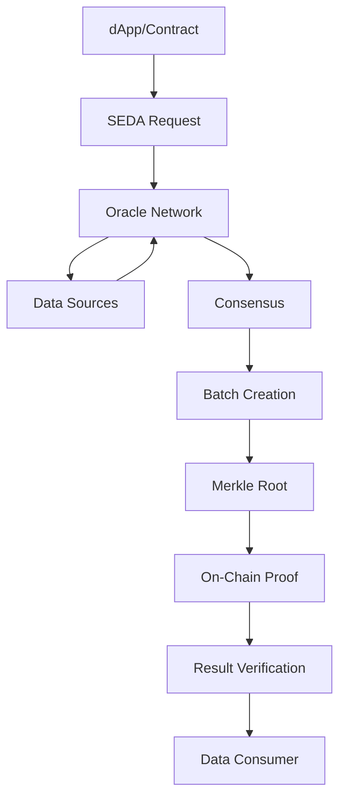
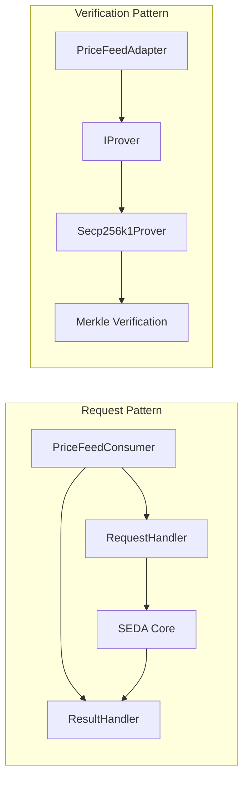

# SEDA Protocol Integration Project

A comprehensive smart contract project demonstrating two different approaches to integrating with the [SEDA Protocol](https://www.seda.xyz/) oracle network. This project showcases both request-based and verification-based oracle consumption patterns.

## 🏗️ Project Overview

This project contains two main contracts that demonstrate different SEDA integration patterns:

### 1. PriceFeedConsumer
A **request-oriented** contract that creates oracle requests and handles responses.

### 2. PriceFeedAdapter  
A **verification-oriented** contract that focuses on verifying oracle results using cryptographic proofs and emitting verification events.

## 📋 Table of Contents

- [What is SEDA?](#what-is-seda)
- [Contract Comparison](#contract-comparison)
- [Installation & Setup](#installation--setup)
- [Usage Examples](#usage-examples)
- [Testing](#testing)
- [Deployment](#deployment)
- [Architecture](#architecture)
- [Contributing](#contributing)

## 🌟 What is SEDA?

SEDA is a modular data layer that allows any blockchain to configure its own data feed from scratch. It provides:

- **Decentralized Oracle Network**: Distributed validators provide secure data feeds
- **Cryptographic Verification**: Results are verified using Merkle proofs and validator consensus
- **Flexible Data Sources**: Support for price feeds, weather data, sports results, and custom APIs
- **Cross-Chain Compatibility**: Works across multiple blockchain networks

## ⚖️ Contract Comparison

| Feature | PriceFeedConsumer | PriceFeedAdapter |
|---------|------------------|------------------|
| **Primary Purpose** | Request creation & response handling | Result verification & event emission |
| **Use Case** | Submit new oracle requests | Verify external oracle results |
| **SEDA Integration** | RequestHandler + ResultHandler | Direct IProver integration |
| **Data Flow** | Request → Oracle → Response | External Result → Verification → Events |
| **Best For** | DeFi apps needing fresh data | Verification services, event monitoring |
| **Gas Usage** | Higher (posting requests) | Lower (verification only) |
| **Complexity** | Medium | Lower (focused verification) |

### PriceFeedConsumer Features
- ✅ **Request Management**: Create and track oracle requests
- ✅ **Response Handling**: Automatic processing of oracle responses  
- ✅ **Fee Management**: Built-in fee handling for requests
- ✅ **Price Storage**: Store and retrieve latest verified prices
- ✅ **Event System**: Comprehensive event logging

### PriceFeedAdapter Features  
- ✅ **Result Verification**: Cryptographic verification using SEDA provers
- ✅ **Event Emission**: Real-time verification success/failure events
- ✅ **Data Integrity**: Consensus and exit code validation
- ✅ **Price Decoding**: Basic price data extraction from oracle results
- ✅ **Prover Management**: Owner-controlled prover address updates

## 🚀 Installation & Setup

### Prerequisites
- Node.js v18+ (v23 has compatibility warnings)
- npm or yarn
- Git

### Installation

```bash
# Clone the repository
git clone <repository-url>
cd pricefeed

# Install dependencies
npm install

# Compile contracts
npx hardhat compile
```

### Environment Setup

Create a `.env` file:

```env
# Network Configuration
SEPOLIA_RPC_URL=https://sepolia.infura.io/v3/YOUR_INFURA_KEY
POLYGON_RPC_URL=https://polygon-rpc.com
PRIVATE_KEY=your_private_key_here

# SEDA Prover Addresses (network-specific)
SEPOLIA_SEDA_PROVER=0x...
POLYGON_SEDA_PROVER=0x...

# Block Explorer API Keys
ETHERSCAN_API_KEY=your_etherscan_key
POLYGONSCAN_API_KEY=your_polygonscan_key
```

## 💡 Usage Examples

### PriceFeedConsumer Usage

```typescript
// Deploy the consumer
const consumer = await PriceFeedConsumer.deploy(
  sedaProverAddress,
  owner,
  execProgramId,
  tallyProgramId
);

// Request a price (pays fees)
const requestId = await consumer.requestPrice("BTC/USD", { value: fees });

// Get latest price
const [price, timestamp] = await consumer.getLatestPrice("BTC/USD");
console.log(`BTC/USD: $${ethers.formatUnits(price, 8)}`);
```

### PriceFeedAdapter Usage (Current Implementation)

The PriceFeedAdapter is a **pure verification contract** focused on validating oracle results:

```typescript
// Deploy the adapter
const adapter = await PriceFeedAdapter.deploy(sedaProverAddress, owner);

// 1. Verify a result (view function - no gas cost)
const [isValid, batchSender] = await adapter.verifyResult(
  oracleResult,
  batchHeight, 
  merkleProof
);

// 2. Submit and verify a result (emits events)
const success = await adapter.submitResult(
  oracleResult,
  batchHeight, 
  merkleProof
);
// Events emitted: ResultVerified or VerificationFailed

// 3. Decode price data from oracle results
const price = await adapter.decodePriceResult(resultData);

// 4. Listen to verification events for real-time monitoring
adapter.on("ResultVerified", (requestId, symbol, price, batchHeight, batchSender) => {
  console.log(`✅ Verified: ${symbol} = $${ethers.formatUnits(price, 8)}`);
});

adapter.on("VerificationFailed", (requestId, reason) => {
  console.log(`❌ Failed: ${requestId} - ${reason}`);
});
```

**Key Characteristics:**
- ✅ **Stateless**: No data storage, pure verification
- ✅ **Event-driven**: Emits events for external monitoring
- ✅ **Gas efficient**: Minimal state changes
- ✅ **Focused**: Does one thing well - cryptographic verification

## 🧪 Testing

Run the comprehensive test suite:

```bash
# Run all tests
npm test

# Run specific contract tests
npx hardhat test test/PriceFeedConsumer.test.ts
npx hardhat test test/PriceFeedAdapter.test.ts

# Run with gas reporting
REPORT_GAS=true npm test
```

### Test Coverage

- **PriceFeedConsumer**: 17 tests covering request lifecycle, fee management, price storage
- **PriceFeedAdapter**: 18 tests covering result verification, event emission, prover management
- **Mock Contracts**: Complete mock prover for isolated testing

## 🚀 Deployment

### Local Development

```bash
# Deploy to local Hardhat network
npx hardhat run scripts/deploy.ts --network localhost
npx hardhat run scripts/deployAdapter.ts --network localhost

# Interact with contracts
npx hardhat run scripts/interact.ts
npx hardhat run scripts/interactAdapter.ts
```

### Testnet Deployment

```bash
# Deploy to Sepolia
npx hardhat run scripts/deploy.ts --network sepolia
npx hardhat run scripts/deployAdapter.ts --network sepolia

# Verify on Etherscan
npx hardhat verify --network sepolia DEPLOYED_ADDRESS "constructor" "args"
```

### Production Deployment

```bash
# Deploy to mainnet (Polygon example)
npx hardhat run scripts/deploy.ts --network polygon
npx hardhat run scripts/deployAdapter.ts --network polygon
```

## 🏛️ Architecture

### SEDA Protocol Flow



### Contract Architecture



### Data Flow Comparison

**PriceFeedConsumer Flow:**
1. Contract posts request to SEDA Core
2. Oracle network processes request
3. Result posted back to contract
4. Automatic validation and storage

**PriceFeedAdapter Flow:**
1. External oracle result with proof
2. Contract verifies proof against prover
3. Validation of consensus and exit codes
4. Event emission for verification results

## 📁 Project Structure

```
pricefeed/
├── contracts/
│   ├── PriceFeedConsumer.sol     # Request-based oracle consumer
│   ├── PriceFeedAdapter.sol      # Verification-based adapter
│   └── mocks/
│       └── MockSedaProver.sol    # Mock prover for testing
├── scripts/
│   ├── deploy.ts                 # Deploy PriceFeedConsumer
│   ├── deployAdapter.ts          # Deploy PriceFeedAdapter
│   ├── interact.ts               # Interact with consumer
│   └── interactAdapter.ts        # Interact with adapter
├── test/
│   ├── PriceFeedConsumer.test.ts # Consumer tests
│   └── PriceFeedAdapter.test.ts  # Adapter tests
├── ignition/
│   └── modules/                  # Hardhat Ignition modules
└── README.md                     # This file
```

## 🔧 Configuration

### Network Configuration

The project supports multiple networks:

- **Local**: Hardhat network with mock prover
- **Sepolia**: Ethereum testnet  
- **Polygon**: Mainnet deployment
- **Custom**: Add your own network configuration

### Gas Optimization

Both contracts are optimized for gas efficiency:

- **Efficient Storage**: Packed structs for minimal storage slots
- **Batch Operations**: Support for multiple operations
- **View Functions**: Extensive read-only functions for off-chain queries

## 🛡️ Security Considerations

### PriceFeedConsumer Security
- ✅ Owner controls for configuration updates
- ✅ Reentrancy protection on critical functions
- ✅ Input validation for all external calls
- ✅ Fee validation and overflow protection

### PriceFeedAdapter Security  
- ✅ Cryptographic verification of all results
- ✅ Consensus validation requirements
- ✅ Batch sender authentication
- ✅ Timestamp and exit code validation

### General Security
- ✅ OpenZeppelin contracts for proven security patterns
- ✅ Comprehensive test coverage
- ✅ Static analysis compatibility
- ✅ Upgrade patterns for future enhancements

## 🌍 Multi-Chain Support

The contracts are designed for easy multi-chain deployment:

- **Ethereum**: Mainnet and testnets
- **Polygon**: MATIC network support
- **Arbitrum**: Layer 2 compatibility  
- **Optimism**: Optimistic rollup support
- **Custom**: Easy adaptation for other EVM chains

## 🔮 Future Enhancements

### Planned Features
- [ ] **Automated Request Management**: Scheduled price updates
- [ ] **Advanced Fee Strategies**: Dynamic fee calculation
- [ ] **Multi-Asset Support**: Portfolio-based price feeds
- [ ] **Integration Templates**: Ready-to-use DeFi integrations
- [ ] **Monitoring Dashboard**: Real-time contract monitoring
- [ ] **Cross-Chain Bridges**: Multi-chain price synchronization

### Integration Roadmap
- [ ] **Chainlink Compatibility**: Dual oracle support
- [ ] **Band Protocol**: Alternative oracle integration
- [ ] **UMA Integration**: Optimistic oracle patterns
- [ ] **Custom Oracles**: Framework for proprietary data sources

## 🤝 Contributing

Contributions are welcome! Please see our contributing guidelines:

1. Fork the repository
2. Create a feature branch
3. Make your changes
4. Add comprehensive tests
5. Submit a pull request

### Development Setup

```bash
# Install development dependencies
npm install --dev

# Run linting
npm run lint

# Run security analysis
npm run security

# Generate documentation
npm run docs
```

## 📄 License

This project is licensed under the MIT License - see the [LICENSE](LICENSE) file for details.

## 🆘 Support

- **Documentation**: [SEDA Protocol Docs](https://docs.seda.xyz)
- **Discord**: [SEDA Community](https://discord.gg/seda)
- **GitHub Issues**: For bugs and feature requests
- **Email**: For private inquiries

## ⚡ Quick Start

```bash
# 1. Setup project
git clone <repo> && cd pricefeed && npm install

# 2. Compile contracts  
npx hardhat compile

# 3. Run tests
npm test

# 4. Deploy locally
npx hardhat run scripts/deployAdapter.ts

# 5. Start building! 🚀
```

---

**Built with ❤️ for the SEDA ecosystem**
